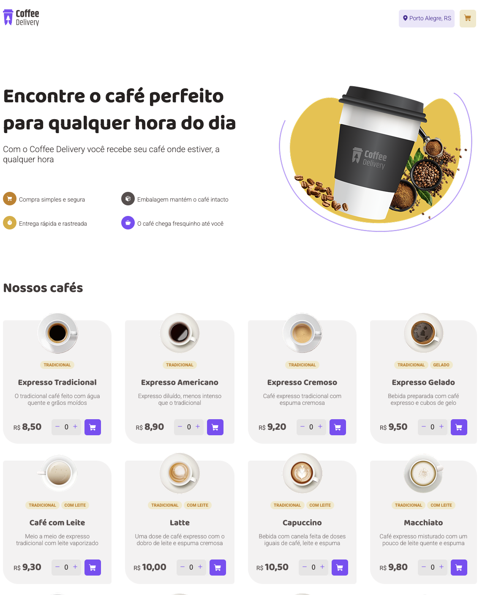

# CoffeeDelivery



<br />

## Configurações

Pelo terminal na raiz do projeto instale as dependências:

```
npm install
```

<br />

## Iniciando a aplicação:

```
npm run start:api
npm run start
```
